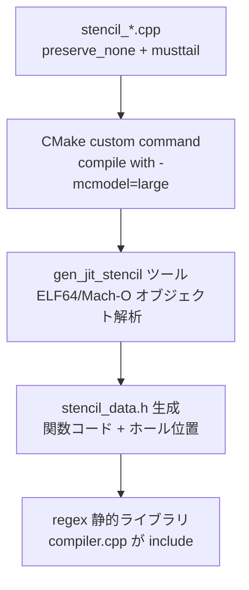
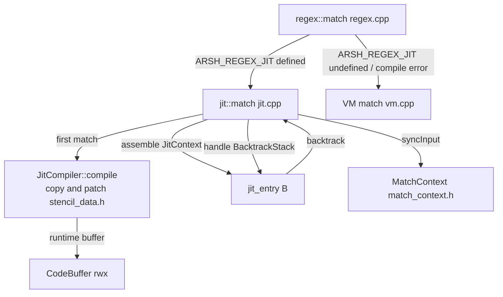

# Requirements

### 概要と目標

`src/regex` 配下の正規表現エンジンに copy-and-patch 方式の JIT コンパイラ機能を追加する。

- 既存の VM 型エンジン (`src/regex/vm.cpp` の `match()`) と同じ ECMA-2025 相当のマッチセマンティクスを保ちつつ、命令ディスパッチをコンパイル済みネイティブコードに置き換えて高速化する。
- JIT コードは既存のバイトコード命令 (`src/regex/instruction.h` の `EACH_RE_OPCODE`、全 35 opcode) に対応するステンシルをプロジェクトビルド時に生成し、JIT コンパイル時にそれらをコピー&パッチして構成する。

### スコープ

**対象 (In Scope)**

- サポート環境: Linux x86-64, Linux aarch64 (aarsh64), macOS aarch64 (aarsh64)。いずれも ELF64 (System V) または Mach-O 64bit ABI 向けのステンシルをビルド時に生成する。
- ビルド環境のコンパイラが `musttail` 属性と `preserve_none` 呼び出し規約に対応している場合のみ JIT 機能を組み込む (CMake によるプローブ + `#cmakedefine USE_REGEX_JIT`)。
- `ARSH_REGEX_JIT` 環境変数が実行時に定義されている場合のみ JIT コンパイルを行い、未定義なら従来の VM 型エンジンを利用する (既存動作の完全な後方互換)。
- 正規表現マッチが最初に行われるタイミングで JIT コンパイルし、生成したネイティブコードを `Regex` インスタンス (コードオブジェクト) にキャッシュする。
- copy-and-patch 方式の内部設計は「共有ドライバ方式」:
  - JIT コードは入力を前進させる直進的な命令実行を担当する。
  - マッチ失敗 (BACKTRACK) / マッチ成功 (Match) で preserve_none のドライバ (`regex::match()` 実装) に戻り、バックトラックは既存 `BacktrackStack` (vm.cpp 流用) で処理した後、該当命令の JIT コードへ再入する。
  - VM と JIT が同一の `MatchContext` / `Input` / `Capture` / `LoopState` / `BacktrackStack` を共有するためセマンティクス差異 (テストで検証すべき箇所) が最小化される。

**対象外 (Out of Scope)**

- バックトラックループ自体の JIT コード化 (フル JIT 方式は行わない)。
- 32bit 環境、Windows 向けステンシル。
- `Timer` (タイムアウト/キャンセル) を JIT 実行ループへ追加ポートする変更 (ドライバ側で既存どおり扱う)。
- `ARSH_REGEX_JIT` 以外の実行時設定の追加。

### 機能要件

1. ビルド時 (CMake): `musttail` / `preserve_none` のサポートをコンパイラプローブで判定し、両方サポートする場合のみ `USE_REGEX_JIT` を定義し、ステンシル生成パイプライン (ビルド時ツール `tools/gen_jit_stencil`) を有効化する。未サポート環境では既存どおり VM のみでビルドが成功する。
2. 実行時: `getenv("ARSH_REGEX_JIT")` が定義されている (値は問わない) 最初の `regex::match()` 呼び出しで、その `Regex` のバイトコードを JIT コンパイルする。以後のマッチではコンパイル済みコードを再利用する (キャッシュ)。生成物はその `Regex` オブジェクトに対して有効。
3. JIT コードはバイトコードの各命令 (Jump / Alt / Char / CharSet / String / BeginLoop / BackRef / LookAround 等、全 35 opcode) を等価なネイティブ実行として表現し、`Input` (イテレータ)、`Capture`、`LoopState`、`BacktrackStack` を VM と同じメモリレイアウトで直接操作する。
4. エラー処理:
   - ステンシルが存在しない命令 (例: `Nop`) や JIT コンパイル中の内部エラー → エラーにせず従来の VM 型エンジンへ自動フォールバック。
   - 実行バッファ (rwx ページ) の確保失敗 → `MatchStatus` の新規エラー値 (例: `JIT_ERROR`) を呼び出し元へ返す (`RegexMatchError` としてスクリプトから観測可能)。
5. マッチ結果 (captures 配列、`MatchStatus`) は VM 型エンジンと同一であること (`ARSH_REGEX_JIT` の有無で結果が変わらないこと)。

### ユーザーストーリー

- スクリプト開発者として、`ARSH_REGEX_JIT=1` を設定して arsh を実行すると、正規表現マッチ (`=~` 演算子、`replace`、`split`) が JIT コンパイルされたコードで動作し高速化される。
- スクリプト開発者として、`ARSH_REGEX_JIT` を設定しなければ、正規表現動作は従来どおり VM 型エンジンで実行され、挙動やエラーが一切変わらないことを期待する。
- パッケージメンテナとして、古いコンパイラ (musttail 非対応など) でも JIT 機能が自動的に無効化され、ビルドが壊れないことを期待する。

# Technical Design

### 現在の実装

- `src/regex/instruction.h`: 全 35 opcode と命令構造体 (`CharIns`, `JumpIns`, `BeginLoopIns` 等)。すべて trivially copyable で `alignof(Inst)` に揃っている。命令列は `FlexBuffer<Inst>`。
- `src/regex/vm.cpp`: `match(MatchContext&, ObserverPtr<Timer>)` が threaded-dispatch VM (ラベルジャンプテーブル)。外側ループで `Input` を先頭から全走査 (find-needle による先頭スキップを含む)。バックトラックは `BacktrackStack` + `Backtrack` union。すべての実行状態 (`Input`, `Capture*`, `LoopState*`, `BacktrackStack`, `foldBuf`, `matchers`) はローカル変数として保持。
- `src/regex/match_context.h`: `MatchContext` が `Regex`, `Input`, `captures`, `loops` を保持。`regex::match()` は `tryToCreateMatchContext()` → `match(ctx)` の順に呼ぶ (`src/regex/regex.cpp:46-53`)。
- `src/regex/regex.h`: `Regex` (コードオブジェクト), `MatchStatus` (enum), `match()` / `replace()` / `split()` の公開 API。
- ビルド時コード生成の先行例: `tools/emoji` (CMake custom command で `gen_emoji_trie` 実行 → `packed_emoji_trie.h` 生成 → `add_dependencies(unicode gen_emoji_trie)`)。同様のパターンが `gen_casefold_table` にもある。
- ビルド時マクロ: `src/config.h.in` の `#cmakedefine` (`USE_LOGGING` 等) → `#include <config.h>` で参照。
- コンパイラ実証 (本プロジェクト環境で検証済み): gcc 16.2 / clang 23 のいずれも、`__attribute__((preserve_none))` + `[[gnu::musttail]]` (gcc) / `[[clang::musttail]]` (clang) のトランポリンが `-Werror` 下で警告ゼロ、実テイルコール (bare `jmp`) を生成。ステンシル TU を `-mcmodel=large` でコンパイルすると未定義シンボル (`jit_next`) への musttail が `movabs $0, %rax; jmp *%rax` + `R_X86_64_64` 再配置として出力され、JIT 時のパッチ可能な「ホール」になることを確認済み。Mach-O (macOS aarsh64) では同ホールが `adr`/`ldr` 系の `BRANCH26`/`PAGE21` 再配置で生成される (抽出対象はリロケーション付きの命令幅のみ)。

### 主要な決定事項 (ユーザー回答済み)

1. **JIT実行方式: 共有ドライバ方式** — JIT コードは入力前進のみを担当し、BACKTRACK / Match の出口で `match()` ドライバに戻る。バックトラックは既存 `BacktrackStack` をドライバ側で処理してから該当命令に再入する。実装・検証コスト最小で、VM と完全にセマンティクスを共有する。
2. **ステンシル抽出: オブジェクト解析方式** — CMake custom command でステンシル TU (`src/regex/jit/stencil_*.cpp`) を `-mcmodel=large` でコンパイルし、自前実装のビルド時パーサ (`tools/gen_jit_stencil`, ELF64 / Mach-O のみ対応) が関数コードとリロケーション (ホール) を抽出して `src/regex/jit/stencil_data.h` を生成する。外部ツール依存なし。
3. **失敗時挙動** — コード生成の失敗 (未対応命令、内部エラー) は VM へ自動フォールバック。実行バッファ (mprotect/posix_memalign 失敗など) の確保失敗はエラー (`MatchStatus::JIT_ERROR` 相当) を返す。
4. **有効化条件** — CMake プローブ (`check_cxx_source_compiles`) で `preserve_none` + `musttail` の両方が使える場合のみ `USE_REGEX_JIT` を定義。ステンシル/コードパッチャ/JIT ランタイムは `#ifdef USE_REGEX_JIT` でコンパイル対象から外れる。

### 提案する変更 (ファイル一覧)

| ファイル | 変更種別 | 内容 |
|---|---|---|
| `src/regex/jit/jit_context.h` | 追加 | JIT 実行時の `JitContext` 構造体 (下記契約参照) |
| `src/regex/jit/stencil_context.h` | 追加 | ステンシル TU が include するヘッダ (`JitContext` 定義と stencil 関数プロトタイプ宣言のみ。生成データに依存しない) |
| `src/regex/jit/stencil_*.cpp` (複数, 例: `stencil_char.cpp`, `stencil_jumps.cpp`, `stencil_capture.cpp`, `stencil_loop.cpp`, `stencil_radix.cpp`) | 追加 | 35 opcode 相当のステンシル関数群。`-mcmodel=large` でビルド (アドレス絶対参照のホールが単純になるため) |
| `tools/gen_jit_stencil/{main.cpp, object_file.h, object_file_elf.cpp, object_file_macho.cpp, ...}` | 追加 | ビルド時ツール。ステンシル TU の .o (ELF64 または Mach-O) をパースし、関数コード + 再配置箇所を抽出して `src/regex/jit/stencil_data.h` を生成 |
| `src/regex/jit/stencil_data.h` | 生成 | ビルド時生成 (tools/gen_jit_stencil)。`struct Stencil { addr, size, holes[] }` と `EACH_RE_OPCODE` 順の配列 + マクロ定数 |
| `src/regex/jit/code_buffer.h` | 追加 | rwx コード実行バッファ (`posix_memalign` + `mprotect`, Linux/macOS 共通) |
| `src/regex/jit/compiler.h` / `compiler.cpp` | 追加 | copy-and-patch コンパイラ: バイトコード走査 (dump.cpp と同じ opcode switch) → 各命令のステンシルコピー → ホールへパッチ (next / branch target / capture index / matcher index) |
| `src/regex/jit/jit.cpp` | 追加 | JIT ドライバ: `MatchContext` から `JitContext` を組み立て、`JitEntry(ctx)` を呼び、戻り値に応じて既存 `BacktrackStack` を処理して再入 (vm.cpp の `BACKTRACK` ループと等価な制御フロー) |
| `src/regex/jit/stencil_runtime.cpp` | 追加 | ステンシル TU から only宣言されるヘルパ (`consumeForward` など、ホールとは別の plain `preserve_none` 関数) の実体。ステンシルと異なり通常コンパイル (リロケーション解決はリンク時) |
| `src/regex/regex.h` / `regex.cpp` | 変更 | `Regex` に `JitCode` ポインタ (キャッシュ) を追加、`match()` エントリポイントに JIT ディスパッチ + フォールバック、`MatchStatus::JIT_ERROR` の追加 |
| `src/CMakeLists.txt` (root) | 変更 | `USE_REGEX_JIT` プローブ、stencil TU の `-mcmodel=large` ビルド、`tools/gen_jit_stencil` の custom command、生成ヘッダの依存関係追加 |
| `src/config.h.in` | 変更 | `#cmakedefine USE_REGEX_JIT` |
| `test/regex/regex_jit_test.cpp` | 追加 | JIT 契約テスト (下記 Testing 参照) |
| `test/regex/CMakeLists.txt` | 変更 | `regex_jit_test` の追加 (USE_REGEX_JIT 時のみビルド) |

### ステンシル生成パイプライン (ビルド時)



- ステンシル関数の命名は `stencil_<opcode>` (例: `stencil_Char`)。`gen_jit_stencil` は `EACH_RE_OPCODE` のシンボル名 (`_ZN4arsh5regex3jit8stencil_CharER...` の mangled 名を解決) を列挙して抽出する。
- 各ステンシル内の「次のブロック呼び出し」は、musttail で未定義シンボル `jit_next` (前方宣言のみ) を呼ぶ形で書き、その再配置をホールとして記録する (x86-64 では `movabs` + `jmp *%rax` の即値 8 バイト、aarch64 ではブランチ系再配置の対象フィールド)。x86-64 では `-mcmodel=large` を指定し、musttail がホール付きの間接ジャンプとして安定して出力されることを保証する。
- 生成データ構造 (概略):
  ```c
  struct StencilHole { uint32_t offset; uint32_t size; };
  struct Stencil { const uint8_t *code; uint32_t size; std::span<StencilHole> holes; };
  // opcode ごとに静的配列 as table indexed by toUnderlying(OpCode)
  ```

### JIT ランタイム契約 (copy-and-patch 時)

- 実行コードの入口: `JIT_TARGET int32_t jit_entry(JitContext&)` がパッチ済みバッファの先頭 (START 相当)。
- ステンシル関数はすべて同一シグネチャ `int32_t(JitContext&) noexcept` + `preserve_none`。返り値: `0`=次の命令へ継続 (呼び出し側が戻り値を見て再入)、`-1`=バックトラック、`-2`=マッチ成功。
- パッチ種別:
  - `next` ホール: バイトコード上の「次の命令」に対応するパッチ済みコードのアドレス (JIT コンパイル時に既知、2 パスでアドレス解決)。
  - 分岐ターゲット (`Jump`, `Alt`, `BeginLoop.outer`, `EndLoop.target`, `BeginLookAround.target`): 対応命令アドレスへ同様にパッチ。
  - 即値 (code point / matcher index / capture index / invert / ignoreCase / min/max / radix 情報など): `stencil_data.h` に記録された「パラメータホール」へ memcpy で書き込む (ホール位置はビルド時に判明)。
- `JitContext` は VM ローカル変数と同じメンバを持つ (実装簡略のためポインタベース):
  ```c
  struct JitContext {
    Input *input;             // vm.cpp の input と同一オブジェクト
    Capture *captures;        // MatchContext::getCaptures()
    LoopState *loopStates;    // MatchContext::getLoops()
    ArrayRef<Matcher> matchers; // regex.getMatchers()
    BacktrackStack *bts;      // 既存のバックトラックスタック
    std::string *foldBuf;     // vm.cpp の foldBuf
    MatchContext *ctx;        // resolveNamedBackRef / syncInput 用
  };
  ```
- 命令ごとの実装方針: `vm.cpp` の `vmcase(X)` ブロックの直進部 (入力消費とキャプチャ更新、分岐先計算) をそのままステンシル関数本体として移植する。BACKTRACK 到達時は戻り値 `-1` でドライバへ戻る。ループ (`BeginLoop`/`EndLoop`) はカウンタ更新と分岐先の選択のみをステンシルで行い、`bts.prepareLoopBody` 等のスタック操作は戻り値 + `JitContext` からドライバ側で実行する。

### copy-and-patch コンパイラとキャッシュ

- `JitCompiler::compile(const Regex&)`:
  1. バイトコードを `dump.cpp` と同じ方式 (`switch (inst->op)` + `sizeof(Ins)` 進行) で走査し、各命令のオフセット → JIT コード内アドレスの 2 パスで解決しながらステンシルをコピー&パッチする。
  2. START (外側ループの先頭再入) 用アドレスと命令オフセット→アドレスの対応表を保持する。
  3. 途中で未対応命令 (例: `NopIns` をステンシル化しない選択をした場合等) があれば `Optional<JitCode>` を空で返し、呼び出し側は VM へフォールバックする。
- `JitCode` は `Regex` 内にキャッシュされ、以後の `match()` 呼び出しで再利用される (マッチが最初に行われるときに一度だけコンパイル)。
- `regex::match()` (regex.cpp) でのディスパッチ:
  ```c
  if (useRegexJit()) {                       // ARSH_REGEX_JIT env, 一度だけ解決してキャッシュ
    if (!regex.jitCode()) {                  // 最初のマッチで JIT コンパイル & キャッシュ
      auto code = jit::compile(regex);       // 失敗時は nullopt → VM フォールバック
      regex.setJitCode(std::move(code));
    }
    if (regex.jitCode()) {
      return jit::match(ctx, timer);         // バックトラックは既存 BacktrackStack をドライバで処理
    }
  }
  return match(ctx, timer);                  // 従来 VM
  ```
- `useRegexJit()` は `USE_REGEX_JIT` 未定義時は常に `false` を返す (コンパイラ最適化で消える)。実行バッファ確保失敗は `MatchStatus::JIT_ERROR` を新設して返す。

### アーキテクチャ図 (ランタイム)



### リスク

- **ステンシル抽出の機械語フォーマット依存**: コンパイラ/バージョンによっては musttail がホールではなく直接 `jmp rel32` になる可能性 → `-mcmodel=large` + `preserve_none` の組み合わせで本プロジェクトの gcc 16.2 / clang 23 で `movabs`+`jmp *%rax` を出力することを実機で確認済み。ビルド時パーサが想定外の形式 (ホールなし直ジャンプ) を検出したら CMake で失敗させて早期発見する。aarch64 (Linux/macOS) はホール幅 (アドレス絶対参照: `movz/movk 4命令 or adrp+add+br`) を実機のクロスコンパイルまたは CI 上で必ず検証する。
- **rwx ページ**: macOS/Linux とも W^X (SIP/SELinux) で失敗する可能性 → `mprotect` 失敗時は `MatchStatus::JIT_ERROR` を返す (仕様どおり)。W^X に配慮し、書き込み中のみ `PROT_WRITE` を付与する方式で実装する。
- **VM セマンティクスとの乖離**: `CharSet` (外側ループでの先頭スキップ) や `Input::create` による VALIDATION は vm.cpp と全く同じコードパスを使うため差異が出ない。ループ/ルックアラウンドはスタック操作をドライバ側に残す設計で差異を最小化する。`ARSH_REGEX_JIT` の有無で結果が変わらないことを gtest で全テストケースを二重実行して検証する。
- **`Timer` (タイムアウト/キャンセル)**: JIT 側はバックトラック発生時のみドライバへ戻るため、vm.cpp と同じ `TIMER_CHECK_INTERVAL` 間隔でタイマチェックが実行される (バックトラックのたびにドライバに制御が戻るため)。無限ループで戻らないケースはステンシルの入力消費が必ず進む/進まないを vm.cpp と同じ構造に保つことで回避する。

# Testing

### 検証アプローチ

- `regex_jit_test` (gtest) を `test/regex/` に追加し、`USE_REGEX_JIT` が有効なビルドでのみビルドする。既存の `regex_test.cpp` / `regex_e2e_test.cpp` (48 cases) をそのまま活かし、VM と JIT の一致を gtest 上で直接比較する。
- コンパイラプローブが正しく機能することを、CMake の configure 出力と `config.h` で確認する。

### 主要シナリオ

1. **二重実行比較**: `regex_test.cpp` の主要パターン (alt, any, boundary, capture, caseless, backref, lookaround, loop, radix/emoji, string) を `ARSH_REGEX_JIT` 定義あり/なしの 2 回実行し、`MatchStatus` と captures 配列が完全一致することを検証する。
2. **キャッシュ動作**: 同一 `Regex` に対して 2 回以上 `match()` を呼び、2 回目以降は再コンパイルされない (コンパイル回数カウンタまたは JitCode ポインタ不変) ことを検証する。
3. **環境変数ゲート**: `ARSH_REGEX_JIT` 未定義時は JIT コードが生成されない (`Regex::jitCode()` が null のまま) こと、定義時は最初の `match()` 後に非 null になることを検証する。
4. **ステンシル生成**: `gen_jit_stencil` が全 35 opcode 相当のステンシルを抽出できたか (生成ヘッダ内の配列が空でないか) をビルドログと生成ヘッダから確認する。

### エッジケース

- 未対応命令で `compile()` が `nullopt` を返し、VM へフォールバックしてマッチ結果が正しいこと (例: `Nop` をステンシル化しない選択の場合)。
- コンパイルエラー時に例外を投げない (プロジェクトのコーディング規約: exception-free)。
- 空入力、極端に長い入力 (バックトラック大量発生)、`TIMER_CHECK_INTERVAL` を超えるバックトラック数でのタイムアウト挙動が VM と一致すること。
- `Input::create` の INVALID_UTF8 / INPUT_LIMIT は VM と同じエラーパスを通る (JIT は `MatchContext` 構築後に介入するため影響しない)。

### テスト変更

- `test/regex/regex_jit_test.cpp` を新規追加 (gtest, `test_common.h` 使用)。
- `test/regex/CMakeLists.txt` に `regex_jit_test` を追加 (USE_REGEX_JIT 時のみ)。
- 既存 `regex_test` / `regex_e2e_test` は変更せず、JIT 有効化でも Green を維持する。