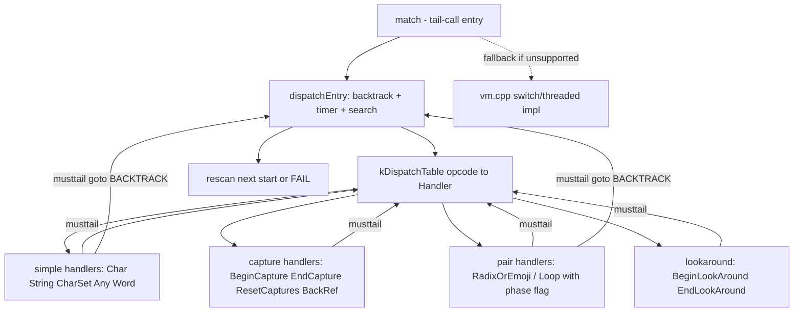

# Requirements

### Overview & Goals

`src/regex/vm.cpp` はバックトラック型正規表現エンジンの本体（インタプリタ）である。現在は 1 つの `match()` 関数内で `switch` / computed-goto（threaded code）により命令をディスパッチしている。

これを、**命令ごとのハンドラ関数を `musttail` で相互末尾呼び出しする tail-call インタプリタ**に置き換え、`preserve_none` 呼び出し規約により**ホットな VM 変数をできるだけ多くレジスタで受け渡す**。目的は正規表現マッチングの実行速度最大化。

### Scope

**In Scope**
- 対象: `x86-64` + Linux + GCC/Clang 環境での tail-call ディスパッチ実装。
- `musttail` と `preserve_none` の**ビルド時機能検出**によるバックエンド自動切替。
- 既存 `switch`/threaded 実装は**フォールバックとして維持**（挙動の後方互換を保証）。
- CMake オプションで tail-call 版を明示的に無効化可能にする。
- ホット変数のレジスタ渡し（8〜9 引数 + 状態ポインタ）。

**Out of Scope**
- バックトラックアルゴリズム自体、命令セット（`EACH_RE_OPCODE`）、パーサ/エミッタ、`Matcher` のロジック変更。
- `MatchStatus` の意味論・公開 API（`regex.h`）の変更。
- 非 x86-64（AArch64 等）向けの tail-call 最適化。（現行動作を維持）

### Functional Requirements

1. `musttail` / `preserve_none` が利用可能な環境では、自動的に tail-call バックエンドが選択される。
2. 利用不可の環境（MSVC、非対応アーキテクチャ等）では**既存 `switch`/threaded 実装に自動フォールバック**し、ビルドと動作が従来どおり成立する。
3. `-DUSE_TAILCALL_VM=OFF` により、対応環境でも明示的に従来実装を選択できる。
4. サニタイザビルド（`-fsanitize=...`、`-O1`、`-fno-optimize-sibling-calls`）では tail-call を無効化しフォールバックを使う。
5. 両バックエンドで**マッチ結果が完全に一致**する（`MatchStatus`、`captures`、`ctx` に同期される入力位置）。
6. タイマーによるキャンセル/タイムアウト、`MAX_STACK_DEPTH` 超過時の `STACK_LIMIT` が従来どおり機能する。

### User Stories

- **As a** ライブラリ利用者, **I want** 正規表現マッチングがより高速に動作してほしい, **so that** 大量テキスト処理のスループットが向上する。
- **As a** 移植先の開発者, **I want** 非対応コンパイラ/アーキテクチャでもビルドが通ってほしい, **so that** 既存の移植性が損なわれない。

### Non-Functional Requirements

- プロジェクト標準フラグ `-Werror -Wall -Wextra -fstack-protector-strong`、C++17 で警告なくビルドできること。
- tail-call 版は「末尾呼び出しが成立しなかった場合にコンパイルエラーになる」性質を利用し、ハンドラごとのスタック成長が起きないことをコンパイル時に保証する。
- デバッグ性を損なわない（`USE_LOGGING` / `USE_SAFE_CAST` のビルドも成立）。

# Technical Design

### Current Implementation

`src/regex/vm.cpp`（865 行）の `match(MatchContext &ctx, ObserverPtr<Timer> timer)` が唯一の実装。構造は 4 層:

1. **初期化** — `Input input = ctx.copyInput()`, `inst`, `matchers`, `loopStates`, `captures`, `BacktrackStack bts(inst)`, `foldBuf`。
2. **`START:` ラベル** — `Char`/`String`/`CharSet` 用の「検索文字列の高速パス」。失敗時は `BACKTRACK` へ。
3. **`BACKTRACK:` ラベル** — `bts.backtrack(inst, input, captures, loopStates)` をループし、成功したら内側 `while(true)` で `vmdispatch(inst->op)` によるディスパッチ。`TIMER_CHECK_INTERVAL` ごとに `timer->check()`。
4. **末尾** — バックトラック枯渇時は `input.setIter(oldIter)` で開始位置を 1 文字進め、`ctx.clearCaptures()` して `goto START`。最後に `MatchStatus::FAIL`。

ディスパッチは `-D__GNUC__` で `USE_THREADED_CODE`（`goto *jumpTable[...]`）と `switch` を切り替えている（`#define vmdispatch/vmcase/vmnext`, L312–325）。

**tail-call 化の障害となる「case 間で共有されたラベル」**（`goto` で飛び込み、複数オペコードが同じ本体を共有している）:

| ラベル | 共有元 | 内容 |
|---|---|---|
| `START` | 初期化 / 末尾の再走査 | 検索高速パス |
| `BACKTRACK` | ほぼ全 opcode | `bts.backtrack()` + ディスパッチ |
| `LOOP` | `BeginLoop` / `EndLoop` | `EndLoop` が `inst` を target に設定して本体へフォールスルー |
| `RADIX_OR_EMOJI` | `PrepareRadix` / `RadixOrEmoji` | 前者が state を push して本体へフォールスルー |
| `LBRADIX_OR_EMOJI` | `PrepareLBRadix` / `LBRadixOrEmoji` | 同上（後方版） |

### Key Decisions

1. **新規 TU への分離** — `src/regex/vm_tailcall.cpp` を追加し、既存 `vm.cpp` はフォールバックとして温存。共有部（`BacktrackOp`/`Backtrack`/`BacktrackStack`/`LoopState`）を新ヘッダ `src/regex/vm_common.h` へ抽出して両者から使う。
2. **ラベル跨ぎペアは単一ハンドラに統合** — `PrepareRadix`/`RadixOrEmoji` と `BeginLoop`/`EndLoop` は**フェーズフラグ付き 1 ハンドラ**に統合し、`goto` を排除して末尾呼び出し可能にする。
3. **引数はホットな 8〜9 + 状態ポインタ** — `pc, iter, begin, end, caps, loops, ms, bts` を引数で渡し、`oldIter`/`btCount`/`timer`/`foldBuf`/`MatchContext*` は `TailCallState*` に集約。
4. **属性は「前置」位置に書く**（実測に基づく重要事項。下記 Risks 参照）。
5. **機能検出は CMake のコンパイル実テストで行う** — `__has_attribute` は GCC が `musttail`/`preserve_none` に対して 1 を返す一方、宣言位置では無視するケースがあるため信頼できない。`check_cxx_source_compiles` で実際に `musttail` + `preserve_none` が通るコードをコンパイルして `USE_TAILCALL_VM` を定義する。

### Data Models / Contracts

**ハンドラ型**（`preserve_none` を typedef 側にも前置して呼び出し規約を型で強制する。clang は不一致な呼び出し規約への `musttail` を**コンパイルエラー**にするため、テーブル経由の整合性が自動保証される）:

```cpp
// 属性は必ず前置（戻り値型より前）に置く
#define ARSH_VM_PRESERVE_NONE __attribute__((preserve_none))

using Handler = ARSH_VM_PRESERVE_NONE MatchStatus (*)(
    const Inst *pc,        // 命令ポインタ
    const char *iter,      // 現在位置（Input::iter）
    const char *begin,     // Input::begin
    const char *end,       // Input::end
    Capture *caps,         // captures
    LoopState *loops,      // loopStates
    const Matcher *ms,     // matchers
    BacktrackStack *bts,   // バックトラックスタック
    TailCallState *st);    // oldIter / btCount / timer / foldBuf / ctx

static_assert(sizeof...(上記) == 9);
```

`TailCallState`（ホットでない/可変な集約状態）:

```cpp
struct TailCallState {
  const char *oldIter;                 // Match のキャプチャ開始位置、再走査用
  unsigned int btCount{0};             // TIMER_CHECK_INTERVAL 用カウンタ
  ObserverPtr<Timer> timer;
  std::string foldBuf;                 // findLongestMatched 用スクラッチ
  MatchContext *ctx;                   // named backref 解決 / 最終 syncInput
};
```

**エントリと遷移** — `START`（検索高速パス）と `BACKTRACK`（backtrack + ディスパッチ + タイマー）を 1 つの**通常規約関数** `dispatchEntry(...)` に統合し、全ハンドラはそこへ（または次ハンドラへ）末尾呼び出しする:

```cpp
// 末尾呼び出しヘルパ
#define VM_TAILCALL(PC) \
  do { __attribute__((musttail)) \
         return kDispatchTable[(unsigned)(PC)->op](PC, iter, begin, end, caps, loops, ms, bts, st); } while (false)

// BACKTRACK + START + タイマー + 再走査を担う通常規約関数（ハンドラから末尾呼び出しされる）
MatchStatus dispatchEntry(const Inst *pc, const char *iter, const char *begin, const char *end,
                         Capture *caps, LoopState *loops, const Matcher *ms,
                         BacktrackStack *bts, TailCallState *st) {
  for (;;) {
    if (!bts->backtrack(pc, iter, caps, loops)) return rescanOrFail(...); // 従来の末尾再走査/FAIL
    if (unlikely(++st->btCount == Regex::TIMER_CHECK_INTERVAL)) { /* timer->check() -> CANCEL/TIMEOUT */ }
    if (pc->op == OpCode::Char || pc->op == OpCode::String || pc->op == OpCode::CharSet) {
      /* 従来 START: の検索高速パス。失敗時は continue で backtrack へ */
    }
    return kDispatchTable[(unsigned)pc->op](pc, iter, begin, end, caps, loops, ms, bts, st);
  }
}
```

**ペア統合ハンドラの位相フラグ**（`goto` を排除するため）:

```cpp
// RADIX_OR_EMOJI: PrepareRadix が先に state を push して本体へ「落ちる」構造を 1 関数化
static ARSH_VM_PRESERVE_NONE MatchStatus hRadixOrEmoji(..., const Inst *pc, ...) {
  // 位相 = pc が指す opcode が Prepare* か本体かで判定
  if (pc->op == OpCode::PrepareRadix) { /* push(Backtrack::newRadixState(size)); pc += sizeof(PrepareRadixIns); */ }
  // 以降は従来 RADIX_OR_EMOJI 本体。成功時は VM_TAILCALL(inst + sizeof(RadixOrEmojiIns) + nextOffset)
}
```
`BeginLoop`/`EndLoop` も同様に「`EndLoop` は target へ `pc` を移して位相を本体に正規化」してから共通本体へ入る。

**機能検出 / ガード**（`vm_tailcall.cpp` 冒頭と CMake の二段構え）:

```cpp
// CMakeLists.txt: check_cxx_source_compiles で実際にコンパイルできるか検証して定義
#if defined(ARSH_HAVE_MUSTTAIL_VM) && defined(__x86_64__) && \
    !defined(__SANITIZE_ADDRESS__) && !defined(ARSH_TAILCALL_VM_DISABLED)
#define ARSH_USE_TAILCALL_VM 1
#endif
```

### Proposed Changes

1. **`src/regex/vm_common.h`（新規）** — `vm.cpp` から `BacktrackOp`, `Backtrack`, `BacktrackStack`, `LoopState` を移動（`vm.cpp` は include に置換）。`BacktrackStack::backtrack` / `prepareLoopBody` / `prepareGreedyLoop` / `prepareNonGreedyLoop` / `cleanupLookAround` は両バックエンドから共用するためここに置く。
2. **`src/regex/vm_tailcall.cpp`（新規）** — ハンドラ集合、`kDispatchTable`（`EACH_RE_OPCODE` から生成）、`dispatchEntry`、エントリ `match()` の tail-call 版。
3. **`src/regex/vm.cpp`（変更）** — 共有部の include 化。`match()` は `ARSH_USE_TAILCALL_VM` 未定義時のみコンパイルされる（`#ifndef ARSH_USE_TAILCALL_VM` でガード）。
4. **`CMakeLists.txt`（変更）** — `regex` ライブラリのソースに `src/regex/vm_tailcall.cpp` を追加。`check_cxx_source_compiles` による機能検出、`option(USE_TAILCALL_VM "..." ON)`、サニタイザ時は強制 OFF。

### Components

- `BacktrackStack`（既存・移動）— `backtrack()` の意味論は不変。tail-call 版では各ハンドラから通常呼び出しされる（末尾位置ではない）。
- `dispatchEntry`（新規）— 旧 `BACKTRACK:` / `START:` / タイマー / 再走査を統合した唯一の非 tail-call ループ。
- ハンドラ群（新規・約 30 個）— 旧 `vmcase(...)` の本体を 1 命令 1 関数化。`goto BACKTRACK` → `musttail return dispatchEntry(...)`、`vmnext` → `VM_TAILCALL(pc + sizeof(XxxIns))`。
- ペア統合ハンドラ（新規 4 個）— `RadixOrEmoji`/`LBRadixOrEmoji`/`BeginLoop`(+`EndLoop`)/`EndCapture` 系。

### File Structure

```
src/regex/
  vm_common.h        (新規: BacktrackOp, Backtrack, BacktrackStack, LoopState)
  vm_tailcall.cpp    (新規: tail-call ハンドラ + dispatchEntry + match())
  vm.cpp             (変更: 共有部 include 化, ARSH_USE_TAILCALL_VM ガード)
CMakeLists.txt       (変更: ソース追加, 機能検出, USE_TAILCALL_VM オプション)
```

### Architecture Diagram



### Risks

1. **属性の位置（実測で確認済み）** — GCC 16.2 は `preserve_none` を**戻り値型の前**に置いた場合のみ尊重する（パラメータリスト後の後置では無視され、引数がスタック渡しになる）。`musttail` も同様に宣言位置の後置属性は無視される。**必ず前置**で書くこと。
2. **`musttail` の綴り（実測で確認済み）** — 文レベルの `__attribute__((musttail)) return f(...);` は clang 23 / GCC 16 の**両方**で `-Werror` を通過。一方 `[[gnu::musttail]]` は **clang では unknown attribute として `-Werror` で失敗**する。単一の綴りとして `__attribute__((musttail))` を使う。
3. **レジスタ引数の上限はコンパイラ依存（実測）** — `preserve_none` 下で clang 23 は 12 引数でも全てレジスタに載せたが、GCC はバージョン/コード形状によりスタックへ溢れる場合があった（マテリアライズすると 7 引数目以降が `8(%rsp)` に載るケースを確認）。したがって**上限を攻めず 8〜9 引数 + 状態ポインタ**に留める。
4. **末尾呼び出し不成立はコンパイルエラー** — ローカル変数のアドレスを `musttail` 先へ渡すとビルドが壊れる。`foldBuf` は `TailCallState`（呼び出し側所有）に置き、ハンドラ内ローカル（例: `char data[4]`）のアドレスは末尾呼び出し前にのみ使う。
5. **サニタイザ/デバッグビルドとの非両立** — `-fno-omit-frame-pointer -fno-optimize-sibling-calls -O1` は tail-call を阻害しうるため、`SANITIZER` 指定時は `USE_TAILCALL_VM` を強制 OFF にしてフォールバックさせる。
6. **`-Werror` と未知の属性警告** — 機能検出に失敗した環境で属性が残ると `-Wattributes`/`-Wunknown-attributes` がエラー化する。属性は必ずガード済みマクロ経由で展開する。

# Testing

### Validation Approach

検証は「両バックエンドの結果一致」を軸に行う。tail-call 版と既存 `switch`/threaded 版を切り替えてビルドし、既存テストスイート（`test/regex/regex_test`、`test/regex/regex_e2e_test`）と fuzzing コーパス（`fuzzing/regex_fuzzer.cpp`, `fuzzing/interest_input_regex`）を両者で通し、`MatchStatus` / `captures` / 同期された入力位置が一致することを確認する。

### Key Scenarios

- 両バックエンドで `regex_test` / `regex_e2e_test` が同一結果で成功する。
- `USE_TAILCALL_VM=OFF` でビルドした場合、従来の `switch`/threaded 版が選択されること（`strings`/シンボルまたは生成コードで確認）。
- 非対応環境を模擬（`ARSH_USE_TAILCALL_VM` を無効化）してもビルドが通り、テストが成功する。
- 生成コード検査: 各ハンドラが**プロローグでのレジスタ退避を伴わず**間接 `jmp` で次ハンドラへ遷移していること（`objdump` / `-S` 出力で `jmpq *` を確認、`callq *` が無いこと）、および主要引数がスタックではなくレジスタから読まれていること。

### Edge Cases

- バックトラック枯渇後の再走査（`START` 相当）と `MatchStatus::FAIL`。
- `MAX_STACK_DEPTH` 超過で `MatchStatus::STACK_LIMIT`（`TRY` マクロ相当の経路）。
- タイマーによる `CANCEL` / `TIMEOUT`（`TIMER_CHECK_INTERVAL` 到達時）。
- ペア統合ハンドラの位相分岐: `PrepareRadix` 経由と `RadixOrEmoji` 直接到達の両方、`EndLoop` → `BeginLoop` 本体フォールスルー、後方版 `LBRadixOrEmoji`。
- ルックアラウンド（否定/肯定）と `cleanupLookAround` によるキャプチャ巻き戻し。
- named backref（`ctx.resolveNamedBackRef`）と前方/後方/ignoreCase の各 `BackRef` 変種。
- 空幅ループ（`loop.inputOffset == input.getOffset()`）の無限ループ回避。

### Test Changes

- 新規テストの追加は不要（既存 `regex_test` / `regex_e2e_test` が網羅）。
- バックエンド切替は CMake オプションで行うため、テストターゲット側の変更は不要。
- 各実装段階で当該オペコード群に対応する既存テストが通ることを確認しながら進める。

# Delivery Steps

### ✓ Step 1: Extract shared VM infrastructure and add tail-call capability detection
共有 VM 基盤が `vm_common.h` に抽出され、tail-call バックエンドのビルド時機能検出と CMake オプションが導入される。既存の挙動は一切変わらない。

- `src/regex/vm.cpp` から `BacktrackOp`, `Backtrack` union（`newSetIns` 等のファクトリ含む）, `BacktrackStack`, `LoopState` を新ヘッダ `src/regex/vm_common.h` へ移動する。
- `BacktrackStack::backtrack` / `prepareLoopBody` / `prepareGreedyLoop` / `prepareNonGreedyLoop` / `cleanupLookAround` は両バックエンドから共用するため `vm_common.h` に置く。
- `vm.cpp` は移動分を include に置換し、`match()` 全体を `#ifndef ARSH_USE_TAILCALL_VM` でガードする（未定義＝従来どおり switch/threaded をコンパイル）。
- `CMakeLists.txt` に `check_cxx_source_compiles` による実コンパイル試験を追加し、`musttail` + `preserve_none`（属性は必ず前置位置）が通る場合のみ `ARSH_HAVE_MUSTTAIL_VM` を定義する。
- `option(USE_TAILCALL_VM "enable tail-call VM backend" ON)` を追加し、OFF またはサニタイザ指定（`SANITIZER` 非空）の場合は強制無効化する。
- `regex` ライブラリのソースに `src/regex/vm_tailcall.cpp` を追加し、`ARSH_USE_TAILCALL_VM` 定義を対象ファイルへ伝播させる。
- 検証: この時点で `regex_test` / `regex_e2e_test` が従来どおり成功すること、`USE_TAILCALL_VM=OFF` と非対応模擬でもビルドが通ることを確認する。

### ✓ Step 2: Implement tail-call dispatcher core and control/assertion opcodes
tail-call ディスパッチの中核が動作し、制御系・アサーション系・任意文字系オペコードが末尾呼び出しで処理される。

- `src/regex/vm_tailcall.cpp` にハンドラ型 `Handler`（`preserve_none` を typedef にも前置）と `TailCallState`（`oldIter`, `btCount`, `timer`, `foldBuf`, `ctx`）を定義する。
- `EACH_RE_OPCODE` から `kDispatchTable` を生成する。
- 旧 `BACKTRACK:` / `START:`（検索文字列高速パス）/ タイマー判定 / バックトラック枯渇後の再走査を統合した通常規約関数 `dispatchEntry()` を実装し、新たなエントリ `match(MatchContext&, ObserverPtr<Timer>)` から呼び出す。
- `vmnext` 相当を `__attribute__((musttail)) return kDispatchTable[...](...)` に、`goto BACKTRACK` 相当を `dispatchEntry()` への末尾呼び出しに置き換える。
- 以下のハンドラを実装: `Nop`, `Match`, `Jump`, `Alt`, `Start`, `End`, `Word`, `IWord`, `Any`, `AnyExceptNL`, `LBAny`, `Grapheme`。
- 検証: 属性前置の徹底により `-Werror` ビルドが通り、`regex_test` が成功すること。`-S` 出力でハンドラがプロローグ退避なしの間接 `jmp` にコンパイルされることを確認する。

### ✓ Step 3: Add character and string matching handlers
文字・文字列一致系の全オペコードが tail-call ハンドラとして実装され、リテラル/文字クラス/後方参照を含むパターンが正しくマッチする。

- `Char`, `IChar`, `LBChar` を実装する。
- `CharSet`, `ICharSet`, `LBCharSet` を実装し、`matchers[...].contains()` と `invert` の論理を現行どおり保つ。
- `String`, `LBString` を実装する。
- `BackRef`, `IBackRef`, `LBBackRef` を実装し、named backref は `st->ctx->resolveNamedBackRef()` 経由で解決する。
- ハンドラ内ローカル（例: `char data[4]`）のアドレスは末尾呼び出し前にのみ使用し、`foldBuf` は `TailCallState` 側に置いて `musttail` 成立を保つ。
- 検証: 文字クラス・大文字小文字無視・後方参照・後方読み（look-behind）を含むケースで `regex_test` と `regex_e2e_test` が成功すること。

### ✓ Step 4: Add radix/emoji, capture, loop, and lookaround handlers
残りの全オペコードが tail-call 化され、現行の全機能（絵文字/radix、キャプチャ、量指定子ループ、ルックアラウンド）が従来と同一に動作する。

- `PrepareRadix` と `RadixOrEmoji` を**フェーズフラグ付き単一ハンドラ**に統合し、`goto RADIX_OR_EMOJI` フォールスルーを排除する。
- `PrepareLBRadix` と `LBRadixOrEmoji` を同様に統合し、`findBackwardLongestMatched` 経路を保つ。
- `BeginLoop` と `EndLoop` を**単一ハンドラ**に統合し、`EndLoop` が target へ `pc` を移して本体処理へ入る構造を関数内の位相分岐に置き換える（`loop.inputOffset == input.getOffset()` による空幅ループ回避を維持）。
- `BeginCapture`, `EndCapture`, `LBEndCapture`, `ResetCaptures` を実装する。
- `BeginLookAround`, `EndLookAround` を実装し、`cleanupLookAround` による否定ルックアラウンドのキャプチャ巻き戻しを維持する。
- 検証: 絵文字シーケンス、量指定子（greedy/non-greedy/最小最大）、キャプチャ、肯定/否定ルックアラウンドを含むケースで `regex_test` / `regex_e2e_test` が成功すること。

### ✓ Step 5: Validate backend parity and verify register allocation and performance
両バックエンドの挙動完全一致が確認され、レジスタ渡しと性能向上が実測で裏付けられる。

> **実装結果（実測に基づく計画からの逸脱）**: 両バックエンドの挙動一致は完全に確認できたが、
> 性能はツールチェイン依存で、GCC では switch/threaded 版に劣った（clang はほぼ同等）。
> このため本バックエンドは既定 **OFF** とし `-DUSE_TAILCALL_VM=ON` で有効化する opt-in とした。
> また `musttail` は `assert` と両立しないため `NDEBUG` を必須条件に追加した。

- バックエンド自動切替（対応環境）と `USE_TAILCALL_VM=OFF` / 非対応模擬の両方で `regex_test` と `regex_e2e_test` を実行し、同一結果になることを確認する。
- `fuzzing/regex_fuzzer.cpp` を `fuzzing/interest_input_regex` のコーパスで両バックエンド実行し、差異がないことを確認する。
- 生成コードを `-S` / `objdump` で検査し、各ハンドラが間接 `jmp` で遷移し（`callq *` が存在しない）、引数がスタックではなくレジスタから読まれていることを確認する。
- サニタイザビルド（`SANITIZER` 指定）および `USE_TAILCALL_VM=OFF` でフォールバック経路が正しく選択され、ビルドとテストが成功することを確認する。
- リリースビルドで代表的パターン（リテラル、文字クラス、`.*`、量指定子、後方参照、ルックアラウンド）のマッチング時間を両バックエンドで比較し、劣化がないことを確認する。